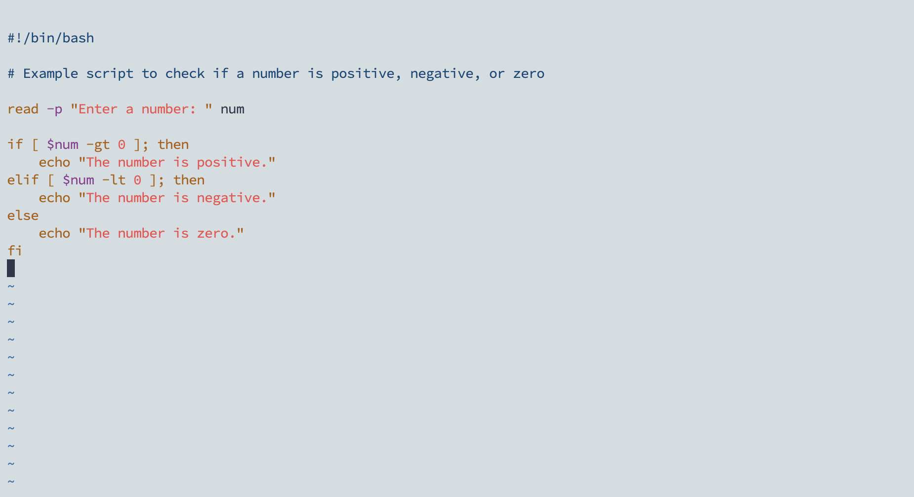
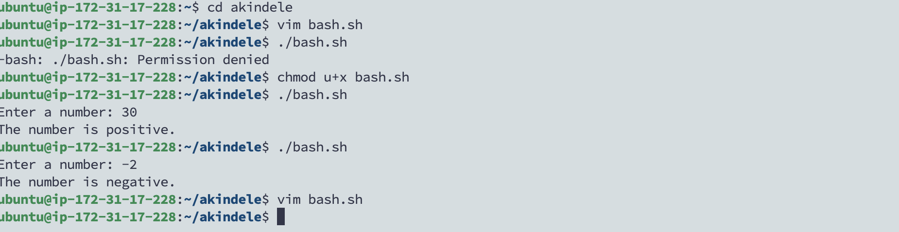
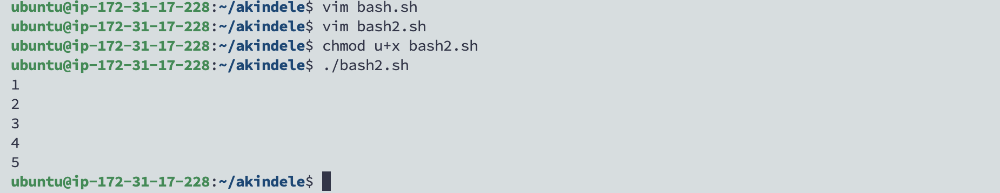
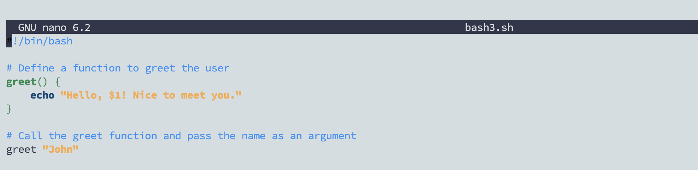
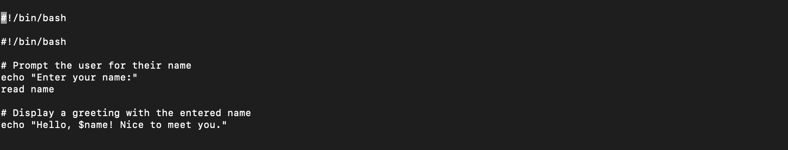
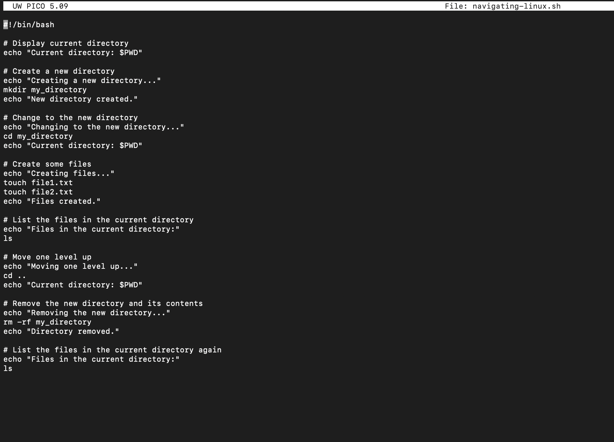
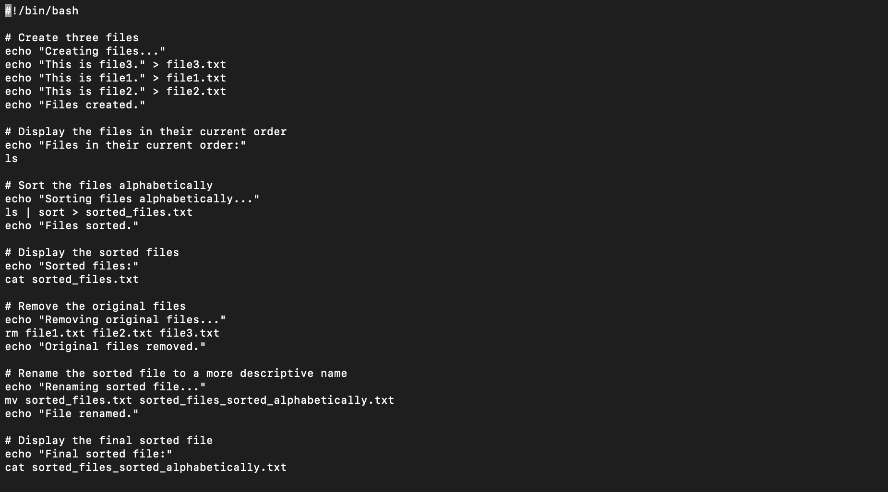
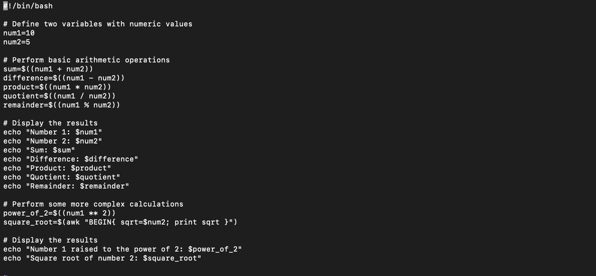
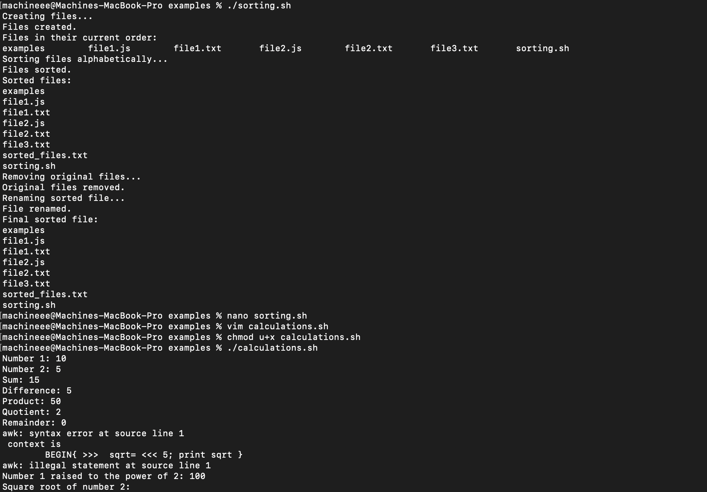

# Introduction to Shell Scripting and User Input:

In this project, executing commands in the terminal and receiving corresponding outputs. These commands essentially instruct the computer to perform specific tasks. For example, when we want to clone a Git repository, we use the command git clone followed by the repository link. Shortly thereafter, we see the repository downloaded onto our local machine.

Let's consider a scenario where you're tasked with cloning 1000 repositories. While you could manually type the git clone command 1000 times, this approach might be tedious and time-consuming. Individuals lacking patience might find it challenging to complete such a task.

+ Automating Tasks with Shell Scripting:

This is where shell scripting comes into play. Shell scripting enables the automation of repetitive tasks. We can write a script to handle the process of cloning the 1000 repositories, executing it once to get the job done. The benefit lies in the ability to reuse this script whenever we encounter a similar task.

Bash scripts are essentially a series of commands and instructions executed sequentially within a shell. You can create a shell script by saving a collection of commands in a text file with a .sh extension. These scripts can be executed directly from the command line or called from other scripts.

+ Understanding Shell Scripting Syntax Elements:

Variables: Bash allows you to define and work with variables, which can store various data types such as numbers, strings, and arrays. Values can be assigned to variables using the = operator, and their values can be accessed using the variable name preceded by a $ sign.
Understanding these fundamentals is crucial for mastering shell scripting and automating repetitive tasks effectively.

## Shell Scripting Syntax Elements

### _**Variables**_

Variables: Bash allows us to define and work with variables. Variables can store data of various types such as numbers, strings, and
arrays.Values can also be assigned to variables using the **=** operator, and access 
their values using the variable name preceded by a **$** sign.

> Example: Assigning value to a variable:

`name="John"`

>Example: Retrieving value from a variable:

`echo $name`

### _**Control Flow**_

Bash provides control flow statements like if-else, for loops, while loops, and case statements to control the flow of execution in your scripts. These statements allow you to make decisions, iterate over lists, and execute different commands based on conditions.

>Example: Using if-else to execute script based on a conditions

_The piece of code prompts you to type a number and prints a statement stating the number is positive or negative._

_Now lets see how the above commands works, take a look at the below_

Another example is

>Iterating through a list using a **for loop**

### _**Command Substitution**_

Command substitution allows you to capture the output of a command and use it as a value within your script.
You can use the backtick or the $0()syntax for command substitution.

>Example: Using backtick for command substitution

`current_date=`date +%Y-%m-%d` `

>Example: Using $() syntax for command substitution

`current_date=$(date +%Y-%m-%d)`

### _**4. Input and Output**_

Bash provides various ways to handle input and output. You can use the read command to accept user input, and output text to the console using the echo command. Additionally, you can redirect input and output using operators like > (output to a file), < (input from a file), and | (pipe the output of one command as input to another).

>Example: Accept user input

`echo "Enter your name:" `

`read name`

>Example: Output text to the terminal

`echo "Hello World'`

>Example: Out the result of a command into a file

`echo "hello world" > index.txt`

>Example: Pass the content of a file as input to a command

`grep "pattern" < input.txt`

>Example: pass the result of a command as input to another command

`echo "hello world" | grep "pattern"`

### _**5. Functions**_

Bash allows you to define and use functions to group related commands together. Functions provide a way to modularize your code and make it more reusable. You can define functions using the function keyword or simply by declaring the function name followed by parentheses.

### _**Let's write our First Shell Script**_

+ Step 1: Open a folder on your terminal and enter _mkdir shell-scripting_ to create a file. This folder will be used to store all the scripts that we will create in this lesson.

+ Step 2: Open a new file within the _shell-scripting_ folder and name it 'user-input.sh'. **cd** into the folder and create a file using _touch_ command.

+ Step 3: Open the 'user_input.sh' file using a text editor e.g **nano** and copy the below block of code into the file:

>A liitle bit about the code block. The script prompts for your name. When you type your name, it displays the text hello! Nice to meet you. Also
**#!/bin/bash** helps you specify the type of bash interpreter to be used to execute the script.

+ Step 4: Save the file using _CTRL X+ Yes+ Enter_

+ Step 5: Run the command `sudo chmod +× user-input.sh` this makes the file executable

+ Step 6: Run the script using the command `./user-input.sh`

### **_Directory Manipulation and Navigation_**

Building upon the lessons of Directory Manipulation and Navigation in the Linux file system, we aim to create a simple shell script for practicing the concepts we have learned. 

This script will display the current directory, create a new directory called "my_directory, change to that directory, create two files inside it, list the files, move back one level up, remove the "my_directory" and its contents, and finally list the files in the current directory again.

> Proceed by following the steps bellow:

+ step 1: open a file named navigating-linux-filesystem.sh

+ step 2: paste the code block below into your file

**Lets take some time to explain what the above script is doing**

* 		#!/bin/bash: This line is called a shebang and indicates the interpreter that should be used to execute the script, in this case, the Bash shell.
* 		echo "Current directory: $PWD": This line prints the current working directory using the $PWD environment variable.
* 		mkdir my_directory: This line creates a new directory named "my_directory" in the current working directory.
* 		echo "New directory created.": This line simply outputs a message indicating that the new directory has been successfully created.
* 		cd my_directory: This command changes the working directory to the newly created "my_directory".
* 		echo "Current directory: $PWD": This line echoes the current working directory, which is now the "my_directory".
* 		touch file1.txt and touch file2.txt: These commands create two empty files named "file1.txt" and "file2.txt" inside the "my_directory".
* 		echo "Files in the current directory:": This line prints a message to indicate that the files in the current directory will be listed.
* 		ls: This command lists the files in the current directory, which in this case are "file1.txt" and "file2.txt".
* 		echo "Moving one level up..." and cd ..: These lines indicate that the script is moving back to the parent directory (one level up from "my_directory").
* 		echo "Current directory: $PWD": This line prints the current working directory after moving up one level.
* 		rm -rf my_directory: This command recursively and forcefully removes the directory "my_directory" along with its contents.
* 		echo "Directory removed.": This line prints a message indicating that the directory has been successfully removed.
*       echo "Files in the current directory:" and ls: These lines print a message and then list the files in the current directory after the deletion, which would be the same as the initial files in the directory before the script execution.
Overall, this script demonstrates basic directory manipulation and navigation operations in a Linux file system using bash commands.

+ step 3: Run the command `sudo chmod + navigating-linux-filesystem. sh` to set execute permission on the file

+ step 4: Run your script using this command `. /navigating-linux-filesystem.sh`

### _**File Operations and Sorting**_

In this lesson, we will be writing a simple shell script that focuses on File Operations and Sorting.
This script creates three files **file 1. txt, file2.txt, and file3.txt**, displays the files in their current order, sorts them alphabetically, saves the sorted files in sorted_files.txt, displays the sorted files, removes the original files, renames the sorted file to sorted_files_sorted_alphabetically.txt, and finally displays the contents of the final sorted file.

Lets proceed using the steps below:

+ step 1: Open your terminal and create a file called sorting.sh using the command `touch sorting. sh`

+ step 2: Copy and paste the code block below into the file

+ step 3: Set execute permission on sorting.sh using this command `sudo chmod +× sorting.sh`

+ step 4: Run your script using the command `•/sorting. sh`

### _**Working with Numbers and Calculations**_

This script defines two variables num1 and num2 with numeric values, performs basic arithmetic operations (addition, subtraction, multiplication, division, and modulus), and displays the results. It also performs more complex calculations such as raising num1 to the power of 2 and calculating the square root of num2, and displays those results as well.

>Lets proceed by following the steps below:

+ step 1: On your terminal create a file called calculations.sh using the command touch calculations. sh

+ step 2: Copy and paste the code block below:

+ step 3: Set execute permission on calculations.sh using the command: `sudo chmod + calculations.sh`

+ step 4: Run your script using this command: `•/calculations. sh`

## _**File Backup and Timestamping**_

 **File Backup and Timestamping**

This shell scripting example is focused on file backup and timestamp. As a DevOps Engineer backing up databases and other storage devices is one of the most common task you get to carryout.
This script defines the source directory and backup directory paths. It then creates a timestamp using the current date and time, and creates a backup directory with the timestamp appended to its name. The script then copies all files from the source directory to the backup directory using the p command with the -r option for recursive copying. Finally, it displays a message indicating the completion of the backup process and shows the path of the backup directory with the timestamp.

>Lets proceed using the steps bellow:

+ step 1: On your terminal open a file backup.sh using the command `touch backup. sh`

+ step 2: Copy and paste the code block below into the file.

This script is essentially creating a backup of a source directory. Let's break down what each part of the script is doing:

#!/bin/bash: This line indicates that the script should be run using the Bash shell.

source_dir and backup_dir: These variables are used to define the source directory and the directory where the backup will be stored.

timestamp=$(date +"%Y%m%d%H%M%S"): This line generates a timestamp using the current date and time in the format YYYYMMDDHHMMSS, which is then stored in the variable timestamp.

backup_dir_with_timestamp="$backup_dir/backup_$timestamp": This line creates a backup directory path that includes the timestamp, which will be used to store the backup.

mkdir -p "$backup_dir_with_timestamp": This command creates the backup directory along with any necessary parent directories. The -p option ensures that the command does not throw an error if the directory already exists.

cp -r "$source_dir"/* "$backup_dir_with_timestamp": This line copies all files and directories from the source directory to the backup directory. The -r option is used to copy directories recursively.

echo "Backup completed. Files copied to: $backup_dir_with_timestamp": This line displays a message indicating that the backup process is complete and specifies the directory where the files have been copied.

In summary, the script essentially takes a source directory, creates a timestamped backup directory, and then copies all files and directories from the source directory to the backup directory. After completion, it prints a message confirming the backup process and specifying the location of the backup directory.

